# ARIA System Flow Charts

> Detailed flow diagrams for each major module in the ARIA platform.

---

## 1. Account Module Flow

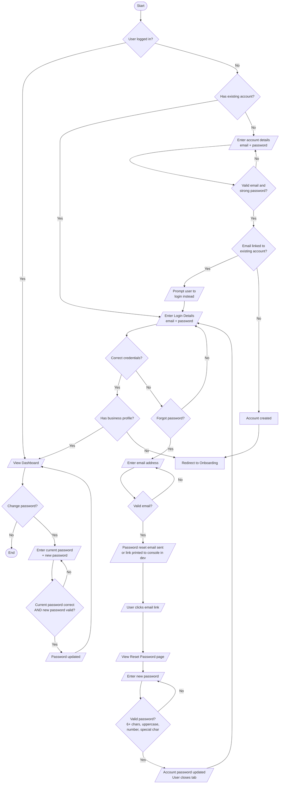

---

## 2. Onboarding Module Flow

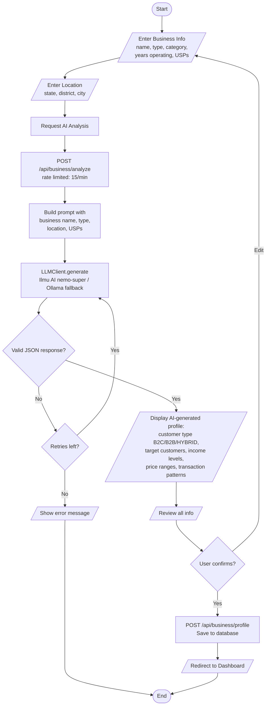

---

## 3. Simulation Flow (End-to-End)

```mermaid
flowchart TD
    Start([Start]) --> Question[/User types question<br/>in ChatPanel/]
    Question --> Suggest[POST /api/simulation/suggest<br/>rate limited: 15/min]
    
    %% --- Scenario Generation ---
    Suggest --> Context{Real-world<br/>context enabled?}
    Context -->|Yes| Fetch[Fetch News API +<br/>DOSM data + Calendar]
    Context -->|No| Skip[Skip external context]
    Fetch --> BuildPrompt
    Skip --> BuildPrompt[Build prompt with<br/>business profile + context]
    BuildPrompt --> GenScenarios[LLM generates 2-5 scenarios<br/>via Ilmu AI / Ollama]
    GenScenarios --> ShowScenarios[/Display scenarios to user/]
    
    %% --- Simulation Start ---
    ShowScenarios --> Select[/User selects scenario<br/>+ configures settings/]
    Select --> StartSim[POST /api/simulation/start<br/>rate limited: 10/min]
    
    %% --- Agent Generation ---
    StartSim --> Cache{Agent cache hit?<br/>same profile + constraints}
    Cache -->|Yes| Reuse[Reuse cached agents<br/>reset per-sim state]
    Cache -->|No| Generate[Generate synthetic population<br/>via IPF + DOSM data]
    Generate --> Profiles[LLM generates personality<br/>profiles in batches of 3]
    Profiles --> CacheStore[Store in agent cache<br/>keyed by profile + constraints]
    CacheStore --> CreateMesa[Create Mesa model + agents<br/>+ income-weighted social network]
    Reuse --> CreateMesa
    
    %% --- Simulation Execution (Single Pass) ---
    CreateMesa --> SSE[Open SSE stream to frontend]
    SSE --> Phase1[Phase 1: Independent Decisions<br/>Each agent decides visit/skip/churn<br/>using LLM brain]
    Phase1 --> Phase2[Phase 2: Peer Influence<br/>Gate check + LLM reconsideration<br/>for susceptible agents]
    Phase2 --> Metrics[Aggregate final metrics]
    Metrics --> Report[Generate report:<br/>risk level, breakdown,<br/>LLM analysis + recommendations]
    
    %% --- Output ---
    Report --> SaveDB[Save to database]
    SaveDB --> Display[/Display report in chat<br/>+ PDF download option/]
    Display --> End([End])
```

---

## 4. Population Generation Flow (IPF)

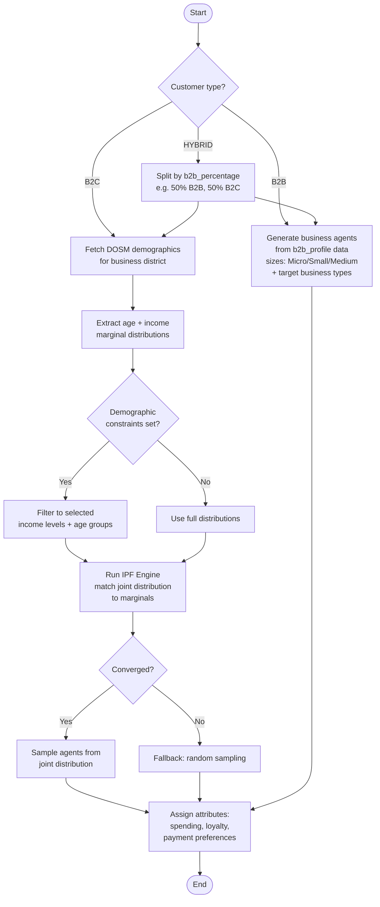

---

## 5. LLM Integration Flow (Ilmu AI + Ollama Failover)

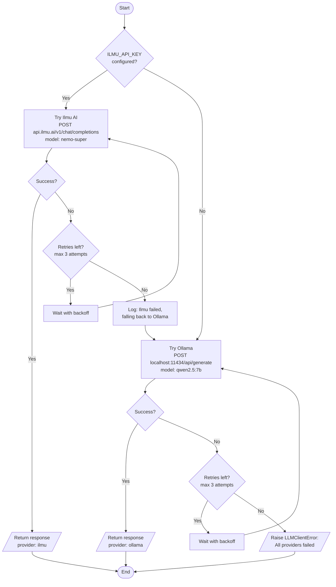

---

## 6. Chat & Session Flow

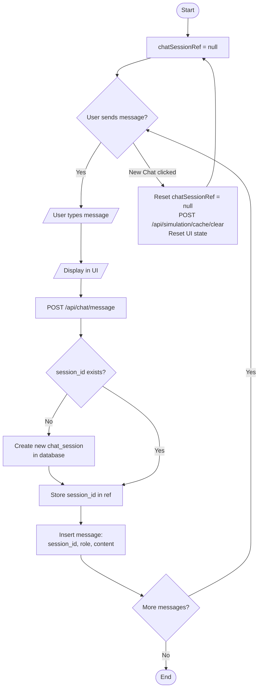

---

## 7. Report & Revenue Flow

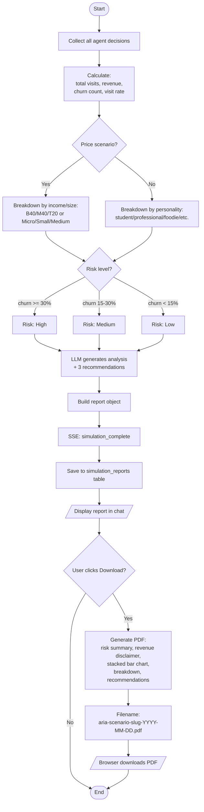

---

## 8. Simulation History Flow

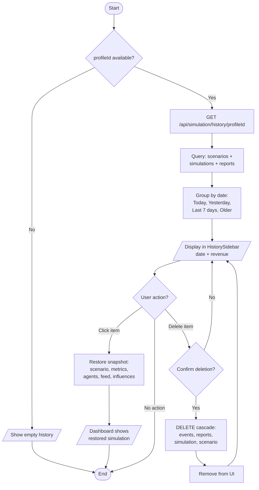

---

## 9. Database Operations Flow

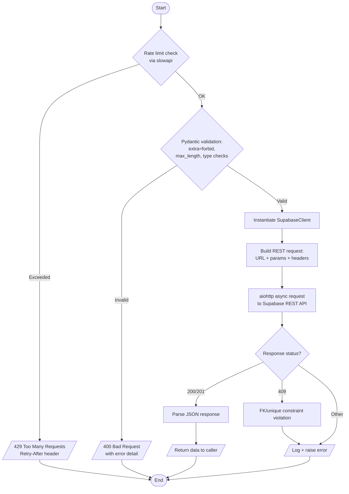

---

## 10. External Data Integration

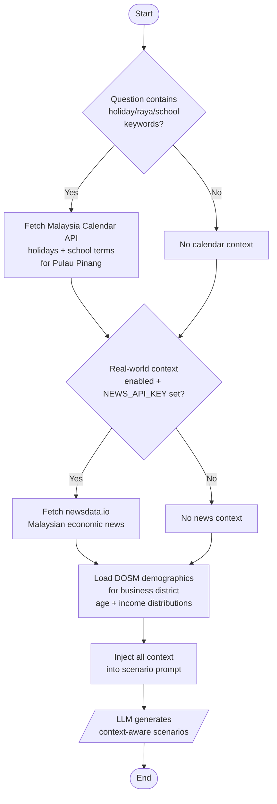

---

## 11. Security Flow

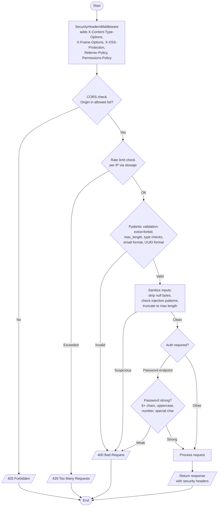
